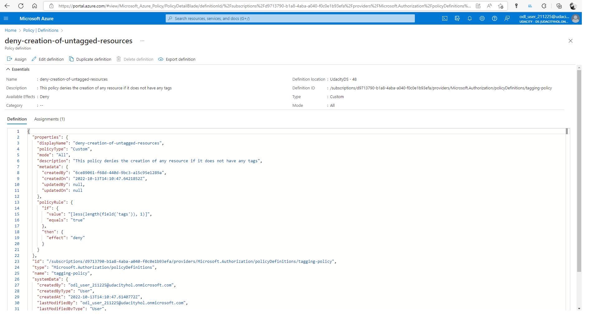
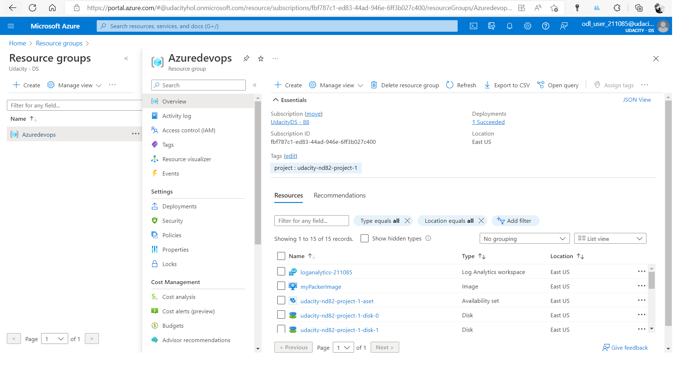

# Project Log

This file contains the steps that I made to complete this project.

## Policy definition

See the file **./policy/tagging_policy.json**. The only required policy is to enforce the existence of at least one tag.

Resulting output:

```
D:\udacity-azure-project1>az policy assignment list
[
  {
    "description": null,
    "displayName": null,
    "enforcementMode": "Default",
    "id": "/subscriptions/fbf787c1-ed83-44ad-946e-6ff3b027c400/providers/Microsoft.Authorization/policyAssignments/tagging-policy",
    "identity": null,
    "location": null,
    "metadata": {
      "createdBy": "bb80efb2-85cd-44b1-afef-bd509b202af6",
      "createdOn": "2022-10-12T12:27:06.1621198Z",
      "updatedBy": null,
      "updatedOn": null
    },
    "name": "tagging-policy",
    "nonComplianceMessages": null,
    "notScopes": null,
    "parameters": null,
    "policyDefinitionId": "/subscriptions/fbf787c1-ed83-44ad-946e-6ff3b027c400/providers/Microsoft.Authorization/policyDefinitions/Tagging-Policy",
    "scope": "/subscriptions/fbf787c1-ed83-44ad-946e-6ff3b027c400",
    "systemData": {
      "createdAt": "2022-10-12T12:27:06.134545+00:00",
      "createdBy": "odl_user_211085@udacityhol.onmicrosoft.com",
      "createdByType": "User",
      "lastModifiedAt": "2022-10-12T12:27:06.134545+00:00",
      "lastModifiedBy": "odl_user_211085@udacityhol.onmicrosoft.com",
      "lastModifiedByType": "User"
    },
    "type": "Microsoft.Authorization/policyAssignments"
  },
  {
    "parameters": null,
    "policyDefinitionId": "/subscriptions/fbf787c1-ed83-44ad-946e-6ff3b027c400/providers/Microsoft.Authorization/policyDefinitions/clouddevops674-211085-PolicyDefinition",
    "scope": "/subscriptions/fbf787c1-ed83-44ad-946e-6ff3b027c400",
    "systemData": {
      "createdAt": "2022-10-12T12:16:05.095860+00:00",
      "createdBy": "0609ced8-c8f7-49fd-91c2-c484ddad694d",
      "createdByType": "Application",
      "lastModifiedAt": "2022-10-12T12:16:06.107313+00:00",
      "lastModifiedBy": "0609ced8-c8f7-49fd-91c2-c484ddad694d",
      "lastModifiedByType": "Application"
    },
    "type": "Microsoft.Authorization/policyAssignments"
  }
]
```

Screenshot of the policy in Azure:


## Packer Image

The important lesson was that the image should reside in different Azure resource group than the Terraform template. ***Important:*** the variables *"client_id"*, *"client_secret"*, and *"subscription_id"* must be obtained from Azure.
See file **./packer/server.json**.
Note that *managed_image_resource_group_name* is hardcoded to *Azuredevops* and it must preexist in Azure.

## Terraform

### Configuration

For the variables see file **./terraform/vars.tf**.

The main module is in the file: **./terraform/main.tf**.

### Terraform output

```
D:\udacity-azure-project1\terraform>terraform plan -out solution.plan
data.azurerm_image.packer_image: Reading...
azurerm_resource_group.main: Refreshing state... [id=/subscriptions/fbf787c1-ed83-44ad-946e-6ff3b027c400/resourceGroups/Azuredevops]
data.azurerm_image.packer_image: Read complete after 0s [id=/subscriptions/fbf787c1-ed83-44ad-946e-6ff3b027c400/resourceGroups/Azuredevops/providers/Microsoft.Compute/images/myPackerImage]

Terraform used the selected providers to generate the following execution plan. Resource actions are indicated with the following symbols:
  + create

Terraform will perform the following actions:

  # azurerm_availability_set.main will be created
  + resource "azurerm_availability_set" "main" {
      + id                           = (known after apply)
      + location                     = "eastus"
      + managed                      = true
      + name                         = "udacity-nd82-project-1-aset"
      + platform_fault_domain_count  = 3
      + platform_update_domain_count = 5
      + resource_group_name          = "Azuredevops"
      + tags                         = {
          + "project" = "udacity-nd82-project-1"
        }
    }

  # azurerm_lb.main will be created
  + resource "azurerm_lb" "main" {
      + id                   = (known after apply)
      + location             = "eastus"
      + name                 = "udacity-nd82-project-1-lb"
      + private_ip_address   = (known after apply)
      + private_ip_addresses = (known after apply)
      + resource_group_name  = "Azuredevops"
      + sku                  = "Basic"
      + sku_tier             = "Regional"
      + tags                 = {
          + "project" = "udacity-nd82-project-1"
        }

      + frontend_ip_configuration {
          + gateway_load_balancer_frontend_ip_configuration_id = (known after apply)
          + id                                                 = (known after apply)
          + inbound_nat_rules                                  = (known after apply)
          + load_balancer_rules                                = (known after apply)
          + name                                               = "PublicIPAddress"
          + outbound_rules                                     = (known after apply)
          + private_ip_address                                 = (known after apply)
          + private_ip_address_allocation                      = (known after apply)
          + private_ip_address_version                         = (known after apply)
          + public_ip_address_id                               = (known after apply)
          + public_ip_prefix_id                                = (known after apply)
          + subnet_id                                          = (known after apply)
        }
    }

  # azurerm_lb_backend_address_pool.main will be created
  + resource "azurerm_lb_backend_address_pool" "main" {
      + backend_ip_configurations = (known after apply)
      + id                        = (known after apply)
      + inbound_nat_rules         = (known after apply)
      + load_balancing_rules      = (known after apply)
      + loadbalancer_id           = (known after apply)
      + name                      = "udacity-nd82-project-1-lb-backend-pool"
      + outbound_rules            = (known after apply)
    }

  # azurerm_lb_probe.main will be created
  + resource "azurerm_lb_probe" "main" {
      + id                  = (known after apply)
      + interval_in_seconds = 15
      + load_balancer_rules = (known after apply)
      + loadbalancer_id     = (known after apply)
      + name                = "udacity-nd82-project-1-web-running-probe"
      + number_of_probes    = 2
      + port                = 8080
      + protocol            = (known after apply)
    }

  # azurerm_lb_rule.main will be created
  + resource "azurerm_lb_rule" "main" {
      + backend_address_pool_ids       = (known after apply)
      + backend_port                   = 8080
      + disable_outbound_snat          = false
      + enable_floating_ip             = false
      + frontend_ip_configuration_id   = (known after apply)
      + frontend_ip_configuration_name = "PublicIPAddress"
      + frontend_port                  = 80
      + id                             = (known after apply)
      + idle_timeout_in_minutes        = (known after apply)
      + load_distribution              = (known after apply)
      + loadbalancer_id                = (known after apply)
      + name                           = "udacity-nd82-project-1-LBRule"
      + probe_id                       = (known after apply)
      + protocol                       = "Tcp"
    }

  # azurerm_linux_virtual_machine.main[0] will be created
  + resource "azurerm_linux_virtual_machine" "main" {
      + admin_password                  = (sensitive value)
      + admin_username                  = "vuongvx"
      + allow_extension_operations      = true
      + availability_set_id             = (known after apply)
      + computer_name                   = (known after apply)
      + disable_password_authentication = false
      + extensions_time_budget          = "PT1H30M"
      + id                              = (known after apply)
      + location                        = "eastus"
      + max_bid_price                   = -1
      + name                            = "udacity-nd82-project-1-vm-0"
      + network_interface_ids           = (known after apply)
      + patch_assessment_mode           = "ImageDefault"
      + patch_mode                      = "ImageDefault"
      + platform_fault_domain           = -1
      + priority                        = "Regular"
      + private_ip_address              = (known after apply)
      + private_ip_addresses            = (known after apply)
      + provision_vm_agent              = true
      + public_ip_address               = (known after apply)
      + public_ip_addresses             = (known after apply)
      + resource_group_name             = "Azuredevops"
      + size                            = "Standard_B1s"
      + source_image_id                 = "/subscriptions/fbf787c1-ed83-44ad-946e-6ff3b027c400/resourceGroups/Azuredevops/providers/Microsoft.Compute/images/myPackerImage"
      + tags                            = {
          + "project" = "udacity-nd82-project-1"
        }
      + virtual_machine_id              = (known after apply)

      + os_disk {
          + caching                   = "ReadWrite"
          + disk_size_gb              = (known after apply)
          + name                      = (known after apply)
          + storage_account_type      = "Standard_LRS"
          + write_accelerator_enabled = false
        }

      + termination_notification {
          + enabled = (known after apply)
          + timeout = (known after apply)
        }
    }

  # azurerm_linux_virtual_machine.main[1] will be created
  + resource "azurerm_linux_virtual_machine" "main" {
      + admin_password                  = (sensitive value)
      + admin_username                  = "vuongvx"
      + allow_extension_operations      = true
      + availability_set_id             = (known after apply)
      + computer_name                   = (known after apply)
      + disable_password_authentication = false
      + extensions_time_budget          = "PT1H30M"
      + id                              = (known after apply)
      + location                        = "eastus"
      + max_bid_price                   = -1
      + name                            = "udacity-nd82-project-1-vm-1"
      + network_interface_ids           = (known after apply)
      + patch_assessment_mode           = "ImageDefault"
      + patch_mode                      = "ImageDefault"
      + platform_fault_domain           = -1
      + priority                        = "Regular"
      + private_ip_address              = (known after apply)
      + private_ip_addresses            = (known after apply)
      + provision_vm_agent              = true
      + public_ip_address               = (known after apply)
      + public_ip_addresses             = (known after apply)
      + resource_group_name             = "Azuredevops"
      + size                            = "Standard_B1s"
      + source_image_id                 = "/subscriptions/fbf787c1-ed83-44ad-946e-6ff3b027c400/resourceGroups/Azuredevops/providers/Microsoft.Compute/images/myPackerImage"
      + tags                            = {
          + "project" = "udacity-nd82-project-1"
        }
      + virtual_machine_id              = (known after apply)

      + os_disk {
          + caching                   = "ReadWrite"
          + disk_size_gb              = (known after apply)
          + name                      = (known after apply)
          + storage_account_type      = "Standard_LRS"
          + write_accelerator_enabled = false
        }

      + termination_notification {
          + enabled = (known after apply)
          + timeout = (known after apply)
        }
    }

  # azurerm_managed_disk.disk[0] will be created
  + resource "azurerm_managed_disk" "disk" {
      + create_option                 = "Empty"
      + disk_iops_read_only           = (known after apply)
      + disk_iops_read_write          = (known after apply)
      + disk_mbps_read_only           = (known after apply)
      + disk_mbps_read_write          = (known after apply)
      + disk_size_gb                  = 1
      + id                            = (known after apply)
      + location                      = "eastus"
      + logical_sector_size           = (known after apply)
      + max_shares                    = (known after apply)
      + name                          = "udacity-nd82-project-1-disk-0"
      + public_network_access_enabled = true
      + resource_group_name           = "Azuredevops"
      + source_uri                    = (known after apply)
      + storage_account_type          = "Standard_LRS"
      + tags                          = {
          + "project" = "udacity-nd82-project-1"
        }
      + tier                          = (known after apply)
    }

  # azurerm_managed_disk.disk[1] will be created
  + resource "azurerm_managed_disk" "disk" {
      + create_option                 = "Empty"
      + disk_iops_read_only           = (known after apply)
      + disk_iops_read_write          = (known after apply)
      + disk_mbps_read_only           = (known after apply)
      + disk_mbps_read_write          = (known after apply)
      + disk_size_gb                  = 1
      + id                            = (known after apply)
      + location                      = "eastus"
      + logical_sector_size           = (known after apply)
      + max_shares                    = (known after apply)
      + name                          = "udacity-nd82-project-1-disk-1"
      + public_network_access_enabled = true
      + resource_group_name           = "Azuredevops"
      + source_uri                    = (known after apply)
      + storage_account_type          = "Standard_LRS"
      + tags                          = {
          + "project" = "udacity-nd82-project-1"
        }
      + tier                          = (known after apply)
    }

  # azurerm_network_interface.main[0] will be created
  + resource "azurerm_network_interface" "main" {
      + applied_dns_servers           = (known after apply)
      + dns_servers                   = (known after apply)
      + enable_accelerated_networking = false
      + enable_ip_forwarding          = false
      + id                            = (known after apply)
      + internal_dns_name_label       = (known after apply)
      + internal_domain_name_suffix   = (known after apply)
      + location                      = "eastus"
      + mac_address                   = (known after apply)
      + name                          = "udacity-nd82-project-1-nic-0"
      + private_ip_address            = (known after apply)
      + private_ip_addresses          = (known after apply)
      + resource_group_name           = "Azuredevops"
      + tags                          = {
          + "project" = "udacity-nd82-project-1"
        }
      + virtual_machine_id            = (known after apply)

      + ip_configuration {
          + gateway_load_balancer_frontend_ip_configuration_id = (known after apply)
          + name                                               = "internal"
          + primary                                            = (known after apply)
          + private_ip_address                                 = (known after apply)
          + private_ip_address_allocation                      = "Dynamic"
          + private_ip_address_version                         = "IPv4"
          + subnet_id                                          = (known after apply)
        }
    }

  # azurerm_network_interface.main[1] will be created
  + resource "azurerm_network_interface" "main" {
      + applied_dns_servers           = (known after apply)
      + dns_servers                   = (known after apply)
      + enable_accelerated_networking = false
      + enable_ip_forwarding          = false
      + id                            = (known after apply)
      + internal_dns_name_label       = (known after apply)
      + internal_domain_name_suffix   = (known after apply)
      + location                      = "eastus"
      + mac_address                   = (known after apply)
      + name                          = "udacity-nd82-project-1-nic-1"
      + private_ip_address            = (known after apply)
      + private_ip_addresses          = (known after apply)
      + resource_group_name           = "Azuredevops"
      + tags                          = {
          + "project" = "udacity-nd82-project-1"
        }
      + virtual_machine_id            = (known after apply)

      + ip_configuration {
          + gateway_load_balancer_frontend_ip_configuration_id = (known after apply)
          + name                                               = "internal"
          + primary                                            = (known after apply)
          + private_ip_address                                 = (known after apply)
          + private_ip_address_allocation                      = "Dynamic"
          + private_ip_address_version                         = "IPv4"
          + subnet_id                                          = (known after apply)
        }
    }

  # azurerm_network_interface_backend_address_pool_association.main[0] will be created
  + resource "azurerm_network_interface_backend_address_pool_association" "main" {
      + backend_address_pool_id = (known after apply)
      + id                      = (known after apply)
      + ip_configuration_name   = "internal"
      + network_interface_id    = (known after apply)
    }

  # azurerm_network_interface_backend_address_pool_association.main[1] will be created
  + resource "azurerm_network_interface_backend_address_pool_association" "main" {
      + backend_address_pool_id = (known after apply)
      + id                      = (known after apply)
      + ip_configuration_name   = "internal"
      + network_interface_id    = (known after apply)
    }

  # azurerm_network_security_group.main will be created
  + resource "azurerm_network_security_group" "main" {
      + id                  = (known after apply)
      + location            = "eastus"
      + name                = "udacity-nd82-project-1-sg"
      + resource_group_name = "Azuredevops"
      + security_rule       = [
          + {
              + access                                     = "Allow"
              + description                                = "Allow access to other VMs on the subnet"
              + destination_address_prefix                 = "VirtualNetwork"
              + destination_address_prefixes               = []
              + destination_application_security_group_ids = []
              + destination_port_range                     = "*"
              + destination_port_ranges                    = []
              + direction                                  = "Inbound"
              + name                                       = "AllowVMAccessOnSubnet"
              + priority                                   = 2000
              + protocol                                   = "*"
              + source_address_prefix                      = "VirtualNetwork"
              + source_address_prefixes                    = []
              + source_application_security_group_ids      = []
              + source_port_range                          = "*"
              + source_port_ranges                         = []
            },
          + {
              + access                                     = "Deny"
              + description                                = "Denies direct access from the internet"
              + destination_address_prefix                 = "VirtualNetwork"
              + destination_address_prefixes               = []
              + destination_application_security_group_ids = []
              + destination_port_range                     = "*"
              + destination_port_ranges                    = []
              + direction                                  = "Inbound"
              + name                                       = "DenyDirectAcessFromInternet"
              + priority                                   = 1000
              + protocol                                   = "*"
              + source_address_prefix                      = "Internet"
              + source_address_prefixes                    = []
              + source_application_security_group_ids      = []
              + source_port_range                          = "*"
              + source_port_ranges                         = []
            },
        ]
      + tags                = {
          + "project" = "udacity-nd82-project-1"
        }
    }

  # azurerm_public_ip.main will be created
  + resource "azurerm_public_ip" "main" {
      + allocation_method       = "Static"
      + fqdn                    = (known after apply)
      + id                      = (known after apply)
      + idle_timeout_in_minutes = 4
      + ip_address              = (known after apply)
      + ip_version              = "IPv4"
      + location                = "eastus"
      + name                    = "udacity-nd82-project-1-public-ip"
      + resource_group_name     = "Azuredevops"
      + sku                     = "Basic"
      + sku_tier                = "Regional"
      + tags                    = {
          + "project" = "udacity-nd82-project-1"
        }
    }

  # azurerm_subnet.internal will be created
  + resource "azurerm_subnet" "internal" {
      + address_prefixes                               = [
          + "10.0.2.0/24",
        ]
      + enforce_private_link_endpoint_network_policies = (known after apply)
      + enforce_private_link_service_network_policies  = (known after apply)
      + id                                             = (known after apply)
      + name                                           = "internal"
      + private_endpoint_network_policies_enabled      = (known after apply)
      + private_link_service_network_policies_enabled  = (known after apply)
      + resource_group_name                            = "Azuredevops"
      + virtual_network_name                           = "udacity-nd82-project-1-network"
    }
  # azurerm_virtual_network.main will be created
  + resource "azurerm_virtual_network" "main" {
      + address_space       = [
          + "10.0.0.0/22",
        ]
      + dns_servers         = (known after apply)
      + guid                = (known after apply)
      + id                  = (known after apply)
      + location            = "eastus"
      + name                = "udacity-nd82-project-1-network"
      + resource_group_name = "Azuredevops"
      + subnet              = (known after apply)
      + tags                = {
          + "project" = "udacity-nd82-project-1"
        }
    }

Plan: 19 to add, 0 to change, 0 to destroy.

──────────────────────────────────────────────────────────────────────────────────────────────────────────────────────────────────────────────────────────────────────────────────────────────────────────────── 

Saved the plan to: solution.plan

To perform exactly these actions, run the following command to apply:
    terraform apply "solution.plan"
```

Plan applied successfully. Screenshot of the infrastructure in Azure:

