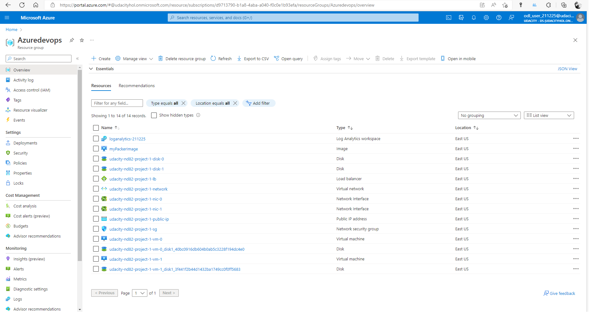

# Project Log

This file contains the steps that I made to complete this project.

## Policy definition

See the file **./policy/tagging_policy.json**. The only required policy is to enforce the existence of at least one tag.

Resulting output:

```
D:\udacity-azure-project1\policy>az policy assignment list
[
  {
    "description": null,
    "displayName": null,
    "enforcementMode": "Default",
    "id": "/subscriptions/d9713790-b1a8-4aba-a040-f0c0e1b93efa/providers/Microsoft.Authorization/policyAssignments/tagging-policy",
    "identity": null,
    "location": null,
    "metadata": {
      "createdBy": "6ce89061-f68d-440d-9bc3-a15c95e1289a",
      "createdOn": "2022-10-13T14:10:55.2089982Z",
      "updatedBy": null,
      "updatedOn": null
    },
    "name": "tagging-policy",
    "nonComplianceMessages": null,
    "notScopes": null,
    "parameters": null,
    "policyDefinitionId": "/subscriptions/d9713790-b1a8-4aba-a040-f0c0e1b93efa/providers/Microsoft.Authorization/policyDefinitions/tagging-policy",
    "scope": "/subscriptions/d9713790-b1a8-4aba-a040-f0c0e1b93efa",
    "systemData": {
      "createdAt": "2022-10-13T14:10:55.178476+00:00",
      "createdBy": "odl_user_211225@udacityhol.onmicrosoft.com",
      "createdByType": "User",
      "lastModifiedAt": "2022-10-13T14:10:55.178476+00:00",
      "createdBy": "0609ced8-c8f7-49fd-91c2-c484ddad694d",
      "createdByType": "Application",
      "lastModifiedAt": "2022-10-13T13:25:36.225547+00:00",
      "lastModifiedBy": "0609ced8-c8f7-49fd-91c2-c484ddad694d",
      "lastModifiedByType": "Application"
    },
    "type": "Microsoft.Authorization/policyAssignments"
  }
]
```

Screenshot of the policy in Azure:


## Packer Image

The important lesson was that the image should reside in different Azure resource group than the Terraform template. ***Important:*** the variables *"client_id"*, *"client_secret"*, and *"subscription_id"* must be obtained from Azure.
See file **./packer/server.json**.
Note that *managed_image_resource_group_name* is hardcoded to *Azuredevops* and it must preexist in Azure.

Resulting output:

```
D:\udacity-azure-project1\packer>packer build server.json
azure-arm: output will be in this color.

==> azure-arm: Running builder ...
==> azure-arm: Getting tokens using client secret
==> azure-arm: Getting tokens using client secret
    azure-arm: Creating Azure Resource Manager (ARM) client ...
==> azure-arm: Getting source image id for the deployment ...
==> azure-arm:  -> SourceImageName: '/subscriptions/d9713790-b1a8-4aba-a040-f0c0e1b93efa/providers/Microsoft.Compute/locations/East US/publishers/Canonical/ArtifactTypes/vmimage/offers/UbuntuServer/skus/18.04-LTS/versions/latest'
==> azure-arm: Creating resource group ...
==> azure-arm:  -> ResourceGroupName : 'pkr-Resource-Group-bb3jodl6hm'
==> azure-arm:  -> Location          : 'East US'
==> azure-arm:  -> Tags              :
==> azure-arm:  ->> resource_type : azure-arm
==> azure-arm: Validating deployment template ...
==> azure-arm:  -> ResourceGroupName : 'pkr-Resource-Group-bb3jodl6hm'
==> azure-arm:  -> DeploymentName    : 'pkrdpbb3jodl6hm'
==> azure-arm: Deploying deployment template ...
==> azure-arm:  -> ResourceGroupName : 'pkr-Resource-Group-bb3jodl6hm'
==> azure-arm:  -> DeploymentName    : 'pkrdpbb3jodl6hm'
==> azure-arm:
==> azure-arm: Getting the VM's IP address ...
==> azure-arm:  -> ResourceGroupName   : 'pkr-Resource-Group-bb3jodl6hm'
==> azure-arm:  -> PublicIPAddressName : 'pkripbb3jodl6hm'
==> azure-arm:  -> NicName             : 'pkrnibb3jodl6hm'
==> azure-arm:  -> Network Connection  : 'PublicEndpoint'
==> azure-arm:  -> IP Address          : '20.185.60.126'
==> azure-arm: Waiting for SSH to become available...
==> azure-arm: Connected to SSH!
==> azure-arm: Uploading http.service => ~/http.service
==> azure-arm: Provisioning with shell script: C:\Users\vuong\AppData\Local\Temp\packer-shell300989385
    azure-arm: Hit:1 http://azure.archive.ubuntu.com/ubuntu bionic InRelease
    azure-arm: Get:2 http://azure.archive.ubuntu.com/ubuntu bionic-updates InRelease [88.7 kB]
    azure-arm: Get:3 http://azure.archive.ubuntu.com/ubuntu bionic-backports InRelease [83.3 kB]
    azure-arm: Get:4 http://azure.archive.ubuntu.com/ubuntu bionic-security InRelease [88.7 kB]
    azure-arm: Get:5 http://azure.archive.ubuntu.com/ubuntu bionic/universe amd64 Packages [8570 kB]
    azure-arm: Get:6 http://azure.archive.ubuntu.com/ubuntu bionic/universe Translation-en [4941 kB]
    azure-arm: Get:7 http://azure.archive.ubuntu.com/ubuntu bionic/multiverse amd64 Packages [151 kB]
    azure-arm: Get:8 http://azure.archive.ubuntu.com/ubuntu bionic/multiverse Translation-en [108 kB]
    azure-arm: Get:9 http://azure.archive.ubuntu.com/ubuntu bionic-updates/main amd64 Packages [2767 kB]
    azure-arm: Get:10 http://azure.archive.ubuntu.com/ubuntu bionic-updates/main Translation-en [509 kB]
    azure-arm: Get:11 http://azure.archive.ubuntu.com/ubuntu bionic-updates/restricted amd64 Packages [956 kB]
    azure-arm: Get:12 http://azure.archive.ubuntu.com/ubuntu bionic-updates/restricted Translation-en [133 kB]
    azure-arm: Get:13 http://azure.archive.ubuntu.com/ubuntu bionic-updates/universe amd64 Packages [1850 kB]
    azure-arm: Get:14 http://azure.archive.ubuntu.com/ubuntu bionic-updates/universe Translation-en [401 kB]
    azure-arm: Get:15 http://azure.archive.ubuntu.com/ubuntu bionic-updates/multiverse amd64 Packages [24.9 kB]
    azure-arm: Get:16 http://azure.archive.ubuntu.com/ubuntu bionic-updates/multiverse Translation-en [6012 B]
    azure-arm: Get:17 http://azure.archive.ubuntu.com/ubuntu bionic-backports/main amd64 Packages [53.3 kB]
    azure-arm: Get:18 http://azure.archive.ubuntu.com/ubuntu bionic-backports/main Translation-en [14.5 kB]
    azure-arm: Get:19 http://azure.archive.ubuntu.com/ubuntu bionic-backports/universe amd64 Packages [18.1 kB]
    azure-arm: Get:20 http://azure.archive.ubuntu.com/ubuntu bionic-backports/universe Translation-en [8668 B]
    azure-arm: Get:21 http://azure.archive.ubuntu.com/ubuntu bionic-security/main amd64 Packages [2426 kB]
    azure-arm: Get:22 http://azure.archive.ubuntu.com/ubuntu bionic-security/main Translation-en [420 kB]
    azure-arm: Get:23 http://azure.archive.ubuntu.com/ubuntu bionic-security/restricted amd64 Packages [927 kB]
    azure-arm: Get:24 http://azure.archive.ubuntu.com/ubuntu bionic-security/restricted Translation-en [128 kB]
    azure-arm: Get:25 http://azure.archive.ubuntu.com/ubuntu bionic-security/universe amd64 Packages [1236 kB]
    azure-arm: Get:26 http://azure.archive.ubuntu.com/ubuntu bionic-security/universe Translation-en [284 kB]
    azure-arm: Get:27 http://azure.archive.ubuntu.com/ubuntu bionic-security/multiverse amd64 Packages [19.0 kB]
    azure-arm: Get:28 http://azure.archive.ubuntu.com/ubuntu bionic-security/multiverse Translation-en [3836 B]
    azure-arm: Fetched 26.2 MB in 7s (4025 kB/s)
    azure-arm: Reading package lists...
    azure-arm: Reading package lists...
    azure-arm: Building dependency tree...
    azure-arm: Reading state information...
    azure-arm: Calculating upgrade...
    azure-arm: The following package was automatically installed and is no longer required:
    azure-arm:   linux-headers-4.15.0-193
    azure-arm: Use 'sudo apt autoremove' to remove it.
    azure-arm: The following packages will be upgraded:
    azure-arm:   isc-dhcp-client isc-dhcp-common libgmp10 linux-cloud-tools-common
    azure-arm:   linux-tools-common sosreport ubuntu-advantage-tools
    azure-arm: 7 upgraded, 0 newly installed, 0 to remove and 0 not upgraded.
    azure-arm: 6 standard security updates
    azure-arm: Need to get 1175 kB of archives.
    azure-arm: After this operation, 129 kB of additional disk space will be used.
    azure-arm: Get:1 http://azure.archive.ubuntu.com/ubuntu bionic-updates/main amd64 libgmp10 amd64 2:6.1.2+dfsg-2ubuntu0.1 [240 kB] 
    azure-arm: Get:2 http://azure.archive.ubuntu.com/ubuntu bionic-updates/main amd64 isc-dhcp-client amd64 4.3.5-3ubuntu7.4 [243 kB]
    azure-arm: Get:3 http://azure.archive.ubuntu.com/ubuntu bionic-updates/main amd64 isc-dhcp-common amd64 4.3.5-3ubuntu7.4 [44.8 kB]
    azure-arm: Get:4 http://azure.archive.ubuntu.com/ubuntu bionic-updates/main amd64 ubuntu-advantage-tools amd64 27.11.2~18.04.1 [161 kB]
    azure-arm: Get:5 http://azure.archive.ubuntu.com/ubuntu bionic-updates/main amd64 linux-cloud-tools-common all 4.15.0-194.205 [36.8 kB]
    azure-arm: Get:6 http://azure.archive.ubuntu.com/ubuntu bionic-updates/main amd64 linux-tools-common all 4.15.0-194.205 [156 kB]
    azure-arm: Get:7 http://azure.archive.ubuntu.com/ubuntu bionic-updates/main amd64 sosreport amd64 4.3-1ubuntu0.18.04.2 [294 kB]
==> azure-arm: debconf: unable to initialize frontend: Dialog
==> azure-arm: debconf: (Dialog frontend will not work on a dumb terminal, an emacs shell buffer, or without a controlling terminal.)
==> azure-arm: debconf: falling back to frontend: Readline
==> azure-arm: debconf: unable to initialize frontend: Readline
==> azure-arm: debconf: (This frontend requires a controlling tty.)
==> azure-arm: debconf: falling back to frontend: Teletype
==> azure-arm: dpkg-preconfigure: unable to re-open stdin:
    azure-arm: Fetched 1175 kB in 0s (19.8 MB/s)
    azure-arm: (Reading database ... 77082 files and directories currently installed.)
    azure-arm: Preparing to unpack .../libgmp10_2%3a6.1.2+dfsg-2ubuntu0.1_amd64.deb ...
    azure-arm: Unpacking libgmp10:amd64 (2:6.1.2+dfsg-2ubuntu0.1) over (2:6.1.2+dfsg-2) ...
    azure-arm: Setting up libgmp10:amd64 (2:6.1.2+dfsg-2ubuntu0.1) ...
    azure-arm: (Reading database ... 77082 files and directories currently installed.)
    azure-arm: Preparing to unpack .../0-isc-dhcp-client_4.3.5-3ubuntu7.4_amd64.deb ...
    azure-arm: Unpacking isc-dhcp-client (4.3.5-3ubuntu7.4) over (4.3.5-3ubuntu7.3) ...
    azure-arm: Preparing to unpack .../1-isc-dhcp-common_4.3.5-3ubuntu7.4_amd64.deb ...
    azure-arm: Unpacking isc-dhcp-common (4.3.5-3ubuntu7.4) over (4.3.5-3ubuntu7.3) ...
    azure-arm: Preparing to unpack .../2-ubuntu-advantage-tools_27.11.2~18.04.1_amd64.deb ...
    azure-arm: Unpacking ubuntu-advantage-tools (27.11.2~18.04.1) over (27.10.1~18.04.1) ...
    azure-arm: Preparing to unpack .../3-linux-cloud-tools-common_4.15.0-194.205_all.deb ...
    azure-arm: Unpacking linux-cloud-tools-common (4.15.0-194.205) over (4.15.0-193.204) ...
    azure-arm: Preparing to unpack .../4-linux-tools-common_4.15.0-194.205_all.deb ...
    azure-arm: Unpacking linux-tools-common (4.15.0-194.205) over (4.15.0-193.204) ...
    azure-arm: Preparing to unpack .../5-sosreport_4.3-1ubuntu0.18.04.2_amd64.deb ...
    azure-arm: Unpacking sosreport (4.3-1ubuntu0.18.04.2) over (4.3-1ubuntu0.18.04.1) ...
    azure-arm: Setting up ubuntu-advantage-tools (27.11.2~18.04.1) ...
    azure-arm: Installing new version of config file /etc/ubuntu-advantage/help_data.yaml ...
    azure-arm: Installing new version of config file /etc/ubuntu-advantage/uaclient.conf ...
    azure-arm: debconf: unable to initialize frontend: Dialog
    azure-arm: debconf: (Dialog frontend will not work on a dumb terminal, an emacs shell buffer, or without a controlling terminal.)
    azure-arm: debconf: falling back to frontend: Readline
    azure-arm: Setting up linux-cloud-tools-common (4.15.0-194.205) ...
    azure-arm: Setting up isc-dhcp-common (4.3.5-3ubuntu7.4) ...
    azure-arm: Setting up isc-dhcp-client (4.3.5-3ubuntu7.4) ...
    azure-arm: Setting up linux-tools-common (4.15.0-194.205) ...
==> azure-arm:  -> Image ResourceGroupName   : 'Azuredevops'
==> azure-arm:  -> Image Name                : 'myPackerImage'
==> azure-arm:  -> Image Location            : 'East US'
==> azure-arm:
==> azure-arm: Deleting individual resources ...
==> azure-arm: Adding to deletion queue -> Microsoft.Compute/virtualMachines : 'pkrvmbb3jodl6hm'
==> azure-arm: Adding to deletion queue -> Microsoft.Network/networkInterfaces : 'pkrnibb3jodl6hm'
==> azure-arm: Adding to deletion queue -> Microsoft.Network/publicIPAddresses : 'pkripbb3jodl6hm'
==> azure-arm: Adding to deletion queue -> Microsoft.Network/virtualNetworks : 'pkrvnbb3jodl6hm'==> azure-arm: Waiting for deletion of all resources...
==> azure-arm: Attempting deletion -> Microsoft.Network/networkInterfaces : 'pkrnibb3jodl6hm'
==> azure-arm: Attempting deletion -> Microsoft.Compute/virtualMachines : 'pkrvmbb3jodl6hm'
==> azure-arm: Attempting deletion -> Microsoft.Network/publicIPAddresses : 'pkripbb3jodl6hm'
==> azure-arm: Attempting deletion -> Microsoft.Network/virtualNetworks : 'pkrvnbb3jodl6hm'
==> azure-arm:  Deleting -> Microsoft.Compute/disks : '/subscriptions/d9713790-b1a8-4aba-a040-f0c0e1b93efa/resourceGroups/pkr-Resource-Group-bb3jodl6hm/providers/Microsoft.Compute/disks/pkrosbb3jodl6hm'
==> azure-arm: Removing the created Deployment object: 'pkrdpbb3jodl6hm'
==> azure-arm:
==> azure-arm: Cleanup requested, deleting resource group ...
==> azure-arm: Resource group has been deleted.
Build 'azure-arm' finished after 6 minutes 2 seconds.

==> Wait completed after 6 minutes 2 seconds

==> Builds finished. The artifacts of successful builds are:
--> azure-arm: Azure.ResourceManagement.VMImage:

OSType: Linux
ManagedImageResourceGroupName: Azuredevops
ManagedImageName: myPackerImage
ManagedImageId: /subscriptions/d9713790-b1a8-4aba-a040-f0c0e1b93efa/resourceGroups/Azuredevops/providers/Microsoft.Compute/images/myPackerImage
ManagedImageLocation: East US
```
## Terraform

### Configuration

For the variables see file **./terraform/vars.tf**.

The main module is in the file: **./terraform/main.tf**.

### Terraform output

```
D:\udacity-azure-project1\terraform>terraform plan -out solution.plan
data.azurerm_image.packer_image: Reading...
azurerm_resource_group.main: Refreshing state... [id=/subscriptions/d9713790-b1a8-4aba-a040-f0c0e1b93efa/resourceGroups/Azuredevops]
data.azurerm_image.packer_image: Read complete after 1s [id=/subscriptions/d9713790-b1a8-4aba-a040-f0c0e1b93efa/resourceGroups/Azuredevops/providers/Microsoft.Compute/images/myPackerImage]

Terraform used the selected providers to generate the following execution plan. Resource actions are indicated with the following symbols:
  + create

Terraform will perform the following actions:

  # azurerm_availability_set.main will be created
  + resource "azurerm_availability_set" "main" {
      + id                           = (known after apply)
      + location                     = "eastus"
      + managed                      = true
      + name                         = "udacity-nd82-project-1-aset"
      + platform_fault_domain_count  = 3
      + platform_update_domain_count = 5
      + resource_group_name          = "Azuredevops"
      + tags                         = {
          + "project" = "udacity-nd82-project-1"
        }
    }

  # azurerm_lb.main will be created
  + resource "azurerm_lb" "main" {
      + id                   = (known after apply)
      + location             = "eastus"
      + name                 = "udacity-nd82-project-1-lb"
      + private_ip_address   = (known after apply)
      + private_ip_addresses = (known after apply)
      + resource_group_name  = "Azuredevops"
      + sku                  = "Basic"
      + sku_tier             = "Regional"
      + tags                 = {
          + "project" = "udacity-nd82-project-1"
        }

      + frontend_ip_configuration {
          + gateway_load_balancer_frontend_ip_configuration_id = (known after apply)
          + id                                                 = (known after apply)
          + inbound_nat_rules                                  = (known after apply)
          + load_balancer_rules                                = (known after apply)
          + name                                               = "PublicIPAddress"
          + outbound_rules                                     = (known after apply)
          + private_ip_address                                 = (known after apply)
          + private_ip_address_allocation                      = (known after apply)
          + private_ip_address_version                         = (known after apply)
          + public_ip_address_id                               = (known after apply)
          + public_ip_prefix_id                                = (known after apply)
          + subnet_id                                          = (known after apply)
        }
    }

  # azurerm_lb_backend_address_pool.main will be created
  + resource "azurerm_lb_backend_address_pool" "main" {
      + backend_ip_configurations = (known after apply)
      + id                        = (known after apply)
      + inbound_nat_rules         = (known after apply)
      + load_balancing_rules      = (known after apply)
      + loadbalancer_id           = (known after apply)
      + name                      = "udacity-nd82-project-1-lb-backend-pool"
      + outbound_rules            = (known after apply)
    }

  # azurerm_lb_probe.main will be created
  + resource "azurerm_lb_probe" "main" {
      + id                  = (known after apply)
      + interval_in_seconds = 15
      + load_balancer_rules = (known after apply)
      + loadbalancer_id     = (known after apply)
      + name                = "udacity-nd82-project-1-web-running-probe"
      + number_of_probes    = 2
      + port                = 8080
      + protocol            = (known after apply)
    }

  # azurerm_lb_rule.main will be created
  + resource "azurerm_lb_rule" "main" {
      + backend_address_pool_ids       = (known after apply)
      + backend_port                   = 8080
      + disable_outbound_snat          = false
      + enable_floating_ip             = false
      + frontend_ip_configuration_id   = (known after apply)
      + frontend_ip_configuration_name = "PublicIPAddress"
      + frontend_port                  = 80
      + id                             = (known after apply)
      + idle_timeout_in_minutes        = (known after apply)
      + load_distribution              = (known after apply)
      + loadbalancer_id                = (known after apply)
      + name                           = "udacity-nd82-project-1-LBRule"
      + probe_id                       = (known after apply)
      + protocol                       = "Tcp"
    }

  # azurerm_linux_virtual_machine.main[0] will be created
  + resource "azurerm_linux_virtual_machine" "main" {
      + admin_password                  = (sensitive value)
      + admin_username                  = "vuongvx"
      + allow_extension_operations      = true
      + availability_set_id             = (known after apply)
      + computer_name                   = (known after apply)
      + disable_password_authentication = false
      + extensions_time_budget          = "PT1H30M"
      + id                              = (known after apply)
      + location                        = "eastus"
      + max_bid_price                   = -1
      + name                            = "udacity-nd82-project-1-vm-0"
      + network_interface_ids           = (known after apply)
      + patch_assessment_mode           = "ImageDefault"
      + patch_mode                      = "ImageDefault"
      + platform_fault_domain           = -1
      + priority                        = "Regular"
      + private_ip_address              = (known after apply)
      + private_ip_addresses            = (known after apply)
      + provision_vm_agent              = true
      + public_ip_address               = (known after apply)
      + public_ip_addresses             = (known after apply)
      + resource_group_name             = "Azuredevops"
      + size                            = "Standard_B1s"
      + source_image_id                 = "/subscriptions/d9713790-b1a8-4aba-a040-f0c0e1b93efa/resourceGroups/Azuredevops/providers/Microsoft.Compute/images/myPackerImage"
      + tags                            = {
          + "project" = "udacity-nd82-project-1"
        }
      + virtual_machine_id              = (known after apply)

      + os_disk {
          + caching                   = "ReadWrite"
          + disk_size_gb              = (known after apply)
          + name                      = (known after apply)
          + storage_account_type      = "Standard_LRS"
          + write_accelerator_enabled = false
        }

      + termination_notification {
          + enabled = (known after apply)
          + timeout = (known after apply)
        }
    }

  # azurerm_linux_virtual_machine.main[1] will be created
  + resource "azurerm_linux_virtual_machine" "main" {
      + admin_password                  = (sensitive value)
      + admin_username                  = "vuongvx"
      + allow_extension_operations      = true
      + availability_set_id             = (known after apply)
      + computer_name                   = (known after apply)
      + disable_password_authentication = false
      + extensions_time_budget          = "PT1H30M"
      + id                              = (known after apply)
      + location                        = "eastus"
      + max_bid_price                   = -1
      + name                            = "udacity-nd82-project-1-vm-1"
      + network_interface_ids           = (known after apply)
      + patch_assessment_mode           = "ImageDefault"
      + patch_mode                      = "ImageDefault"
      + platform_fault_domain           = -1
      + priority                        = "Regular"
      + private_ip_address              = (known after apply)
      + private_ip_addresses            = (known after apply)
      + provision_vm_agent              = true
      + public_ip_address               = (known after apply)
      + public_ip_addresses             = (known after apply)
      + resource_group_name             = "Azuredevops"
      + size                            = "Standard_B1s"
      + source_image_id                 = "/subscriptions/d9713790-b1a8-4aba-a040-f0c0e1b93efa/resourceGroups/Azuredevops/providers/Microsoft.Compute/images/myPackerImage"
      + tags                            = {
          + "project" = "udacity-nd82-project-1"
        }
      + virtual_machine_id              = (known after apply)

      + os_disk {
          + caching                   = "ReadWrite"
          + disk_size_gb              = (known after apply)
          + name                      = (known after apply)
          + storage_account_type      = "Standard_LRS"
          + write_accelerator_enabled = false
        }

      + termination_notification {
          + enabled = (known after apply)
          + timeout = (known after apply)
        }
    }

  # azurerm_managed_disk.disk[0] will be created
  + resource "azurerm_managed_disk" "disk" {
      + create_option                 = "Empty"
      + disk_iops_read_only           = (known after apply)
      + disk_iops_read_write          = (known after apply)
      + disk_mbps_read_only           = (known after apply)
      + disk_mbps_read_write          = (known after apply)
      + disk_size_gb                  = 1
      + id                            = (known after apply)
      + location                      = "eastus"
      + logical_sector_size           = (known after apply)
      + max_shares                    = (known after apply)
      + name                          = "udacity-nd82-project-1-disk-0"
      + public_network_access_enabled = true
      + resource_group_name           = "Azuredevops"
      + source_uri                    = (known after apply)
      + storage_account_type          = "Standard_LRS"
      + tags                          = {
          + "project" = "udacity-nd82-project-1"
        }
      + tier                          = (known after apply)
    }

  # azurerm_managed_disk.disk[1] will be created
  + resource "azurerm_managed_disk" "disk" {
      + create_option                 = "Empty"
      + disk_iops_read_only           = (known after apply)
      + disk_iops_read_write          = (known after apply)
      + disk_mbps_read_only           = (known after apply)
      + disk_mbps_read_write          = (known after apply)
      + disk_size_gb                  = 1
      + id                            = (known after apply)
      + location                      = "eastus"
      + logical_sector_size           = (known after apply)
      + max_shares                    = (known after apply)
      + name                          = "udacity-nd82-project-1-disk-1"
      + public_network_access_enabled = true
      + resource_group_name           = "Azuredevops"
      + source_uri                    = (known after apply)
      + storage_account_type          = "Standard_LRS"
      + tags                          = {
          + "project" = "udacity-nd82-project-1"
        }
      + tier                          = (known after apply)
    }

  # azurerm_network_interface.main[0] will be created
  + resource "azurerm_network_interface" "main" {
      + applied_dns_servers           = (known after apply)
      + dns_servers                   = (known after apply)
      + enable_accelerated_networking = false
      + enable_ip_forwarding          = false
      + id                            = (known after apply)
      + internal_dns_name_label       = (known after apply)
      + internal_domain_name_suffix   = (known after apply)
      + location                      = "eastus"
      + mac_address                   = (known after apply)
      + name                          = "udacity-nd82-project-1-nic-0"
      + private_ip_address            = (known after apply)
      + private_ip_addresses          = (known after apply)
      + resource_group_name           = "Azuredevops"
      + tags                          = {
          + "project" = "udacity-nd82-project-1"
        }
      + virtual_machine_id            = (known after apply)

      + ip_configuration {
          + gateway_load_balancer_frontend_ip_configuration_id = (known after apply)
          + name                                               = "internal"
          + primary                                            = (known after apply)
          + private_ip_address                                 = (known after apply)
          + private_ip_address_allocation                      = "Dynamic"
          + private_ip_address_version                         = "IPv4"
          + subnet_id                                          = (known after apply)
        }
    }

  # azurerm_network_interface.main[1] will be created
  + resource "azurerm_network_interface" "main" {
      + applied_dns_servers           = (known after apply)
      + dns_servers                   = (known after apply)
      + enable_accelerated_networking = false
      + enable_ip_forwarding          = false
      + id                            = (known after apply)
      + internal_dns_name_label       = (known after apply)
      + internal_domain_name_suffix   = (known after apply)
      + location                      = "eastus"
      + mac_address                   = (known after apply)
      + name                          = "udacity-nd82-project-1-nic-1"
      + private_ip_address            = (known after apply)
      + private_ip_addresses          = (known after apply)
      + resource_group_name           = "Azuredevops"
      + tags                          = {
          + "project" = "udacity-nd82-project-1"
        }
      + virtual_machine_id            = (known after apply)

      + ip_configuration {
          + gateway_load_balancer_frontend_ip_configuration_id = (known after apply)
          + name                                               = "internal"
          + primary                                            = (known after apply)
          + private_ip_address                                 = (known after apply)
          + private_ip_address_allocation                      = "Dynamic"
          + private_ip_address_version                         = "IPv4"
          + subnet_id                                          = (known after apply)
        }
    }

  # azurerm_network_interface_backend_address_pool_association.main[0] will be created
  + resource "azurerm_network_interface_backend_address_pool_association" "main" {
      + backend_address_pool_id = (known after apply)
      + id                      = (known after apply)
      + ip_configuration_name   = "internal"
      + network_interface_id    = (known after apply)
    }

  # azurerm_network_interface_backend_address_pool_association.main[1] will be created
  + resource "azurerm_network_interface_backend_address_pool_association" "main" {
      + backend_address_pool_id = (known after apply)
      + id                      = (known after apply)
      + ip_configuration_name   = "internal"
      + network_interface_id    = (known after apply)
    }

  # azurerm_network_interface_security_group_association.main[0] will be created
  + resource "azurerm_network_interface_security_group_association" "main" {
      + id                        = (known after apply)
      + network_interface_id      = (known after apply)
      + network_security_group_id = (known after apply)
    }

  # azurerm_network_interface_security_group_association.main[1] will be created
  + resource "azurerm_network_interface_security_group_association" "main" {
      + id                        = (known after apply)
      + network_interface_id      = (known after apply)
      + network_security_group_id = (known after apply)
    }

  # azurerm_network_security_group.main will be created
  + resource "azurerm_network_security_group" "main" {
      + id                  = (known after apply)
      + location            = "eastus"
      + name                = "udacity-nd82-project-1-sg"
      + resource_group_name = "Azuredevops"
      + security_rule       = [
          + {
              + access                                     = "Allow"
              + description                                = "Allow access to other VMs on the subnet"
              + destination_address_prefix                 = "VirtualNetwork"
              + destination_address_prefixes               = []
              + destination_application_security_group_ids = []
              + destination_port_range                     = "*"
              + destination_port_ranges                    = []
              + direction                                  = "Inbound"
              + name                                       = "AllowVMAccessOnSubnet"
              + priority                                   = 2000
              + protocol                                   = "*"
              + source_address_prefix                      = "VirtualNetwork"
              + source_address_prefixes                    = []
              + source_application_security_group_ids      = []
              + source_port_range                          = "*"
              + source_port_ranges                         = []
            },
          + {
              + access                                     = "Deny"
              + description                                = "Denies direct access from the internet"
              + destination_address_prefix                 = "VirtualNetwork"
              + destination_address_prefixes               = []
              + destination_application_security_group_ids = []
              + destination_port_range                     = "*"
              + destination_port_ranges                    = []
              + direction                                  = "Inbound"
              + name                                       = "DenyDirectAcessFromInternet"
              + priority                                   = 1000
              + protocol                                   = "*"
              + source_address_prefix                      = "Internet"
              + source_address_prefixes                    = []
              + source_application_security_group_ids      = []
              + source_port_range                          = "*"
              + source_port_ranges                         = []
            },
        ]
      + tags                = {
          + "project" = "udacity-nd82-project-1"
        }
    }

  # azurerm_public_ip.main will be created
  + resource "azurerm_public_ip" "main" {
      + allocation_method       = "Static"
      + fqdn                    = (known after apply)
      + id                      = (known after apply)
      + idle_timeout_in_minutes = 4
      + ip_address              = (known after apply)
      + ip_version              = "IPv4"
      + location                = "eastus"
      + name                    = "udacity-nd82-project-1-public-ip"
      + resource_group_name     = "Azuredevops"
      + sku                     = "Basic"
      + sku_tier                = "Regional"
      + tags                    = {
          + "project" = "udacity-nd82-project-1"
        }
    }

  # azurerm_subnet.internal will be created
  + resource "azurerm_subnet" "internal" {
      + address_prefixes                               = [
          + "10.0.2.0/24",
        ]
      + enforce_private_link_endpoint_network_policies = (known after apply)
      + enforce_private_link_service_network_policies  = (known after apply)
      + id                                             = (known after apply)
      + name                                           = "internal"
      + private_endpoint_network_policies_enabled      = (known after apply)
      + private_link_service_network_policies_enabled  = (known after apply)
      + resource_group_name                            = "Azuredevops"
      + virtual_network_name                           = "udacity-nd82-project-1-network"
    }

  # azurerm_virtual_machine_data_disk_attachment.mount_disk[0] will be created
  + resource "azurerm_virtual_machine_data_disk_attachment" "mount_disk" {
      + caching                   = "ReadWrite"
      + create_option             = "Attach"
      + id                        = (known after apply)
      + lun                       = 0
      + managed_disk_id           = (known after apply)
      + virtual_machine_id        = (known after apply)
      + write_accelerator_enabled = false
    }

  # azurerm_virtual_machine_data_disk_attachment.mount_disk[1] will be created
  + resource "azurerm_virtual_machine_data_disk_attachment" "mount_disk" {
      + caching                   = "ReadWrite"
      + create_option             = "Attach"
      + id                        = (known after apply)
      + lun                       = 10
      + managed_disk_id           = (known after apply)
      + virtual_machine_id        = (known after apply)
      + write_accelerator_enabled = false
    }

  # azurerm_virtual_network.main will be created
  + resource "azurerm_virtual_network" "main" {
      + address_space       = [
          + "10.0.0.0/22",
        ]
      + dns_servers         = (known after apply)
      + guid                = (known after apply)
      + id                  = (known after apply)
      + location            = "eastus"
      + name                = "udacity-nd82-project-1-network"
      + resource_group_name = "Azuredevops"
      + subnet              = (known after apply)
      + tags                = {
          + "project" = "udacity-nd82-project-1"
        }
    }

Plan: 21 to add, 0 to change, 0 to destroy.

─────────────────────────────────────────────────────────────────────────────────────────────────────────────────────────────────────────────────────────────── 

Saved the plan to: solution.plan

To perform exactly these actions, run the following command to apply:
    terraform apply "solution.plan"
```

```
D:\udacity-azure-project1\terraform>terraform apply "solution.plan"
azurerm_public_ip.main: Creating...
azurerm_virtual_network.main: Creating...
azurerm_managed_disk.disk[1]: Creating...
azurerm_managed_disk.disk[0]: Creating...
azurerm_network_security_group.main: Creating...
azurerm_availability_set.main: Creating...
azurerm_availability_set.main: Creation complete after 2s [id=/subscriptions/d9713790-b1a8-4aba-a040-f0c0e1b93efa/resourceGroups/Azuredevops/providers/Microsoft.Compute/availabilitySets/udacity-nd82-project-1-aset]
azurerm_public_ip.main: Still creating... [10s elapsed]
azurerm_managed_disk.disk[0]: Still creating... [10s elapsed]
azurerm_virtual_network.main: Still creating... [10s elapsed]
azurerm_managed_disk.disk[1]: Still creating... [10s elapsed]
azurerm_network_security_group.main: Still creating... [10s elapsed]
azurerm_managed_disk.disk[1]: Creation complete after 11s [id=/subscriptions/d9713790-b1a8-4aba-a040-f0c0e1b93efa/resourceGroups/Azuredevops/providers/Microsoft.Compute/disks/udacity-nd82-project-1-disk-1]
azurerm_managed_disk.disk[0]: Creation complete after 11s [id=/subscriptions/d9713790-b1a8-4aba-a040-f0c0e1b93efa/resourceGroups/Azuredevops/providers/Microsoft.Compute/disks/udacity-nd82-project-1-disk-0]
azurerm_network_security_group.main: Creation complete after 11s [id=/subscriptions/d9713790-b1a8-4aba-a040-f0c0e1b93efa/resourceGroups/Azuredevops/providers/Microsoft.Network/networkSecurityGroups/udacity-nd82-project-1-sg]
azurerm_public_ip.main: Creation complete after 13s [id=/subscriptions/d9713790-b1a8-4aba-a040-f0c0e1b93efa/resourceGroups/Azuredevops/providers/Microsoft.Network/publicIPAddresses/udacity-nd82-project-1-public-ip]
azurerm_lb.main: Creating...
azurerm_virtual_network.main: Creation complete after 13s [id=/subscriptions/d9713790-b1a8-4aba-a040-f0c0e1b93efa/resourceGroups/Azuredevops/providers/Microsoft.Network/virtualNetworks/udacity-nd82-project-1-network]
azurerm_subnet.internal: Creating...
azurerm_lb.main: Creation complete after 5s [id=/subscriptions/d9713790-b1a8-4aba-a040-f0c0e1b93efa/resourceGroups/Azuredevops/providers/Microsoft.Network/loadBalancers/udacity-nd82-project-1-lb]
azurerm_lb_backend_address_pool.main: Creating...
azurerm_lb_probe.main: Creating...
azurerm_subnet.internal: Creation complete after 7s [id=/subscriptions/d9713790-b1a8-4aba-a040-f0c0e1b93efa/resourceGroups/Azuredevops/providers/Microsoft.Network/virtualNetworks/udacity-nd82-project-1-network/subnets/internal]
azurerm_network_interface.main[0]: Creating...
azurerm_network_interface.main[1]: Creating...
azurerm_lb_probe.main: Creation complete after 6s [id=/subscriptions/d9713790-b1a8-4aba-a040-f0c0e1b93efa/resourceGroups/Azuredevops/providers/Microsoft.Network/loadBalancers/udacity-nd82-project-1-lb/probes/udacity-nd82-project-1-web-running-probe]
azurerm_lb_backend_address_pool.main: Creation complete after 8s [id=/subscriptions/d9713790-b1a8-4aba-a040-f0c0e1b93efa/resourceGroups/Azuredevops/providers/Microsoft.Network/loadBalancers/udacity-nd82-project-1-lb/backendAddressPools/udacity-nd82-project-1-lb-backend-pool]
azurerm_lb_rule.main: Creating...
azurerm_network_interface.main[1]: Creation complete after 7s [id=/subscriptions/d9713790-b1a8-4aba-a040-f0c0e1b93efa/resourceGroups/Azuredevops/providers/Microsoft.Network/networkInterfaces/udacity-nd82-project-1-nic-1]
azurerm_lb_rule.main: Creation complete after 2s [id=/subscriptions/d9713790-b1a8-4aba-a040-f0c0e1b93efa/resourceGroups/Azuredevops/providers/Microsoft.Network/loadBalancers/udacity-nd82-project-1-lb/loadBalancingRules/udacity-nd82-project-1-LBRule]
azurerm_network_interface.main[0]: Still creating... [10s elapsed]
azurerm_network_interface.main[0]: Creation complete after 11s [id=/subscriptions/d9713790-b1a8-4aba-a040-f0c0e1b93efa/resourceGroups/Azuredevops/providers/Microsoft.Network/networkInterfaces/udacity-nd82-project-1-nic-0]
azurerm_network_interface_backend_address_pool_association.main[1]: Creating...
azurerm_network_interface_backend_address_pool_association.main[0]: Creating...
azurerm_network_interface_security_group_association.main[1]: Creating...
azurerm_network_interface_security_group_association.main[0]: Creating...
azurerm_linux_virtual_machine.main[0]: Creating...
azurerm_linux_virtual_machine.main[1]: Creating...
azurerm_network_interface_backend_address_pool_association.main[0]: Creation complete after 5s [id=/subscriptions/d9713790-b1a8-4aba-a040-f0c0e1b93efa/resourceGroups/Azuredevops/providers/Microsoft.Network/networkInterfaces/udacity-nd82-project-1-nic-0/ipConfigurations/internal|/subscriptions/d9713790-b1a8-4aba-a040-f0c0e1b93efa/resourceGroups/Azuredevops/providers/Microsoft.Network/loadBalancers/udacity-nd82-project-1-lb/backendAddressPools/udacity-nd82-project-1-lb-backend-pool]
azurerm_network_interface_backend_address_pool_association.main[1]: Creation complete after 6s [id=/subscriptions/d9713790-b1a8-4aba-a040-f0c0e1b93efa/resourceGroups/Azuredevops/providers/Microsoft.Network/networkInterfaces/udacity-nd82-project-1-nic-1/ipConfigurations/internal|/subscriptions/d9713790-b1a8-4aba-a040-f0c0e1b93efa/resourceGroups/Azuredevops/providers/Microsoft.Network/loadBalancers/udacity-nd82-project-1-lb/backendAddressPools/udacity-nd82-project-1-lb-backend-pool]
azurerm_network_interface_security_group_association.main[0]: Creation complete after 10s [id=/subscriptions/d9713790-b1a8-4aba-a040-f0c0e1b93efa/resourceGroups/Azuredevops/providers/Microsoft.Network/networkInterfaces/udacity-nd82-project-1-nic-0|/subscriptions/d9713790-b1a8-4aba-a040-f0c0e1b93efa/resourceGroups/Azuredevops/providers/Microsoft.Network/networkSecurityGroups/udacity-nd82-project-1-sg]
azurerm_network_interface_security_group_association.main[1]: Still creating... [10s elapsed]
azurerm_linux_virtual_machine.main[0]: Still creating... [10s elapsed]
azurerm_linux_virtual_machine.main[1]: Still creating... [10s elapsed]
azurerm_network_interface_security_group_association.main[1]: Still creating... [20s elapsed]
azurerm_linux_virtual_machine.main[0]: Still creating... [20s elapsed]
azurerm_linux_virtual_machine.main[1]: Still creating... [20s elapsed]
azurerm_network_interface_security_group_association.main[1]: Still creating... [30s elapsed]
azurerm_linux_virtual_machine.main[1]: Still creating... [31s elapsed]
azurerm_linux_virtual_machine.main[0]: Still creating... [31s elapsed]
azurerm_network_interface_security_group_association.main[1]: Creation complete after 31s [id=/subscriptions/d9713790-b1a8-4aba-a040-f0c0e1b93efa/resourceGroups/Azuredevops/providers/Microsoft.Network/networkInterfaces/udacity-nd82-project-1-nic-1|/subscriptions/d9713790-b1a8-4aba-a040-f0c0e1b93efa/resourceGroups/Azuredevops/providers/Microsoft.Network/networkSecurityGroups/udacity-nd82-project-1-sg]
azurerm_linux_virtual_machine.main[1]: Still creating... [41s elapsed]
azurerm_linux_virtual_machine.main[0]: Still creating... [41s elapsed]
azurerm_linux_virtual_machine.main[0]: Still creating... [51s elapsed]
azurerm_linux_virtual_machine.main[1]: Still creating... [51s elapsed]
azurerm_linux_virtual_machine.main[1]: Creation complete after 54s [id=/subscriptions/d9713790-b1a8-4aba-a040-f0c0e1b93efa/resourceGroups/Azuredevops/providers/Microsoft.Compute/virtualMachines/udacity-nd82-project-1-vm-1]
azurerm_linux_virtual_machine.main[0]: Creation complete after 57s [id=/subscriptions/d9713790-b1a8-4aba-a040-f0c0e1b93efa/resourceGroups/Azuredevops/providers/Microsoft.Compute/virtualMachines/udacity-nd82-project-1-vm-0]
azurerm_virtual_machine_data_disk_attachment.mount_disk[0]: Creating...
azurerm_virtual_machine_data_disk_attachment.mount_disk[1]: Creating...
azurerm_virtual_machine_data_disk_attachment.mount_disk[0]: Still creating... [10s elapsed]
azurerm_virtual_machine_data_disk_attachment.mount_disk[1]: Still creating... [10s elapsed]
azurerm_virtual_machine_data_disk_attachment.mount_disk[0]: Still creating... [20s elapsed]
azurerm_virtual_machine_data_disk_attachment.mount_disk[1]: Still creating... [20s elapsed]
azurerm_virtual_machine_data_disk_attachment.mount_disk[1]: Still creating... [30s elapsed]
azurerm_virtual_machine_data_disk_attachment.mount_disk[0]: Still creating... [30s elapsed]
azurerm_virtual_machine_data_disk_attachment.mount_disk[1]: Creation complete after 37s [id=/subscriptions/d9713790-b1a8-4aba-a040-f0c0e1b93efa/resourceGroups/Azuredevops/providers/Microsoft.Compute/virtualMachines/udacity-nd82-project-1-vm-1/dataDisks/udacity-nd82-project-1-disk-1]
azurerm_virtual_machine_data_disk_attachment.mount_disk[0]: Creation complete after 37s [id=/subscriptions/d9713790-b1a8-4aba-a040-f0c0e1b93efa/resourceGroups/Azuredevops/providers/Microsoft.Compute/virtualMachines/udacity-nd82-project-1-vm-0/dataDisks/udacity-nd82-project-1-disk-0]

Apply complete! Resources: 21 added, 0 changed, 0 destroyed.
```

Plan applied successfully. Screenshot of the infrastructure in Azure:

